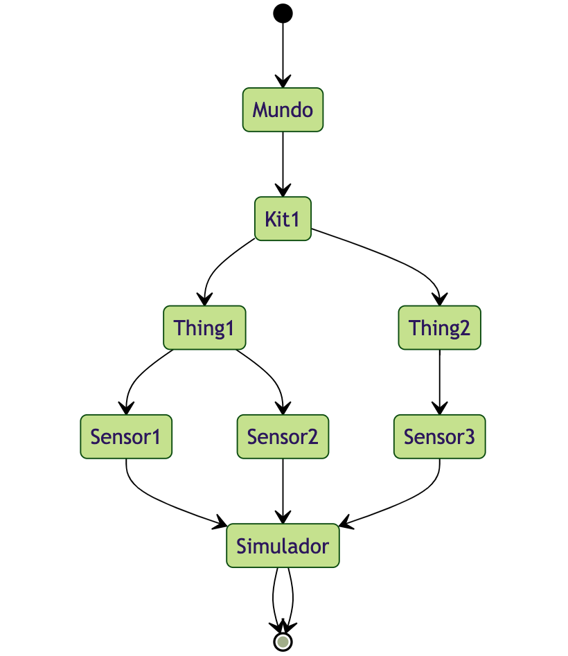
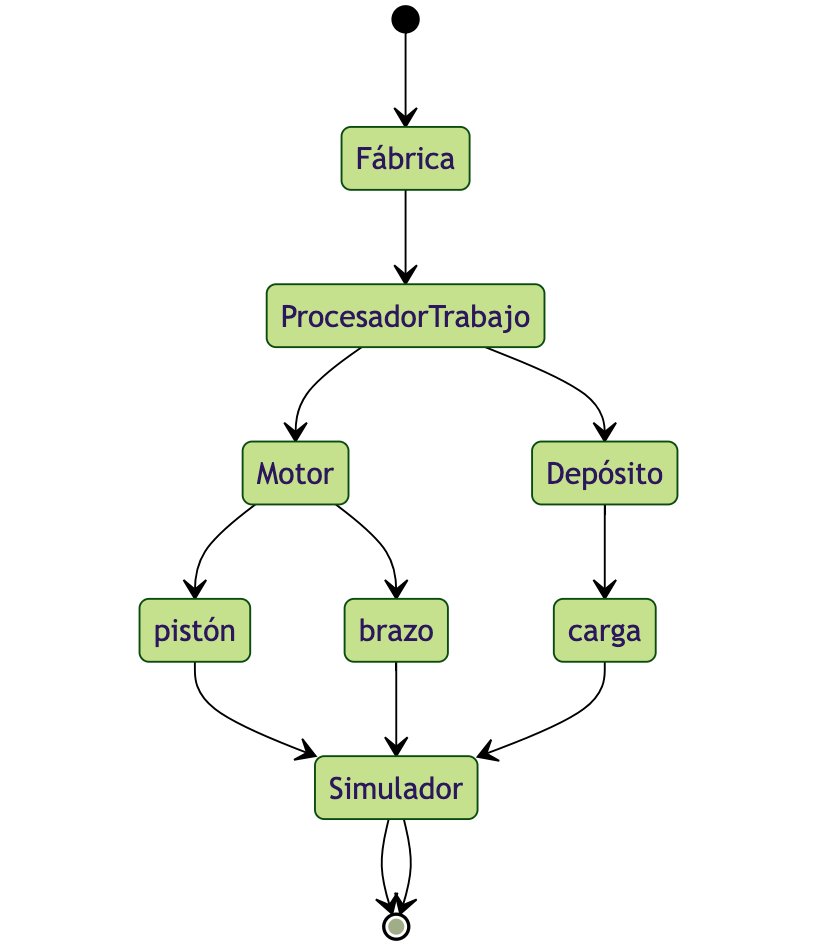
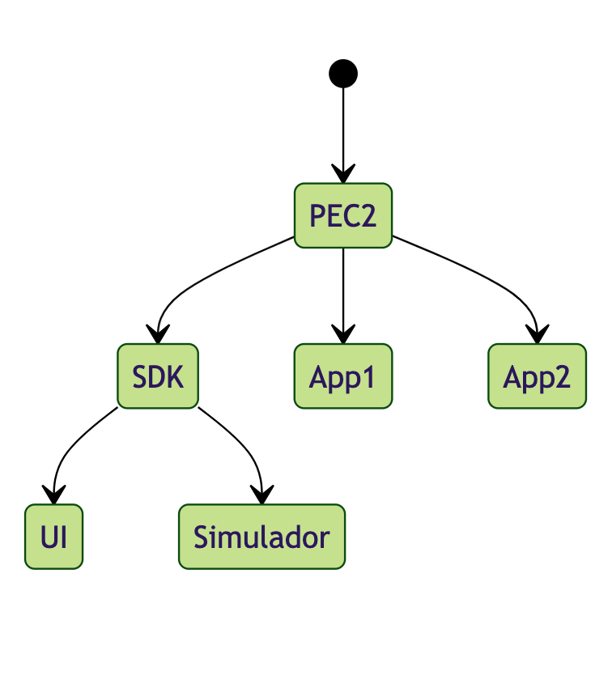
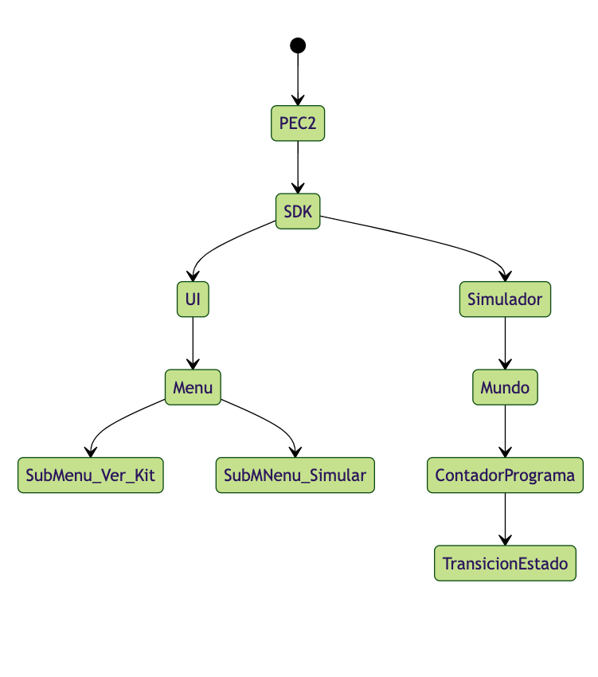
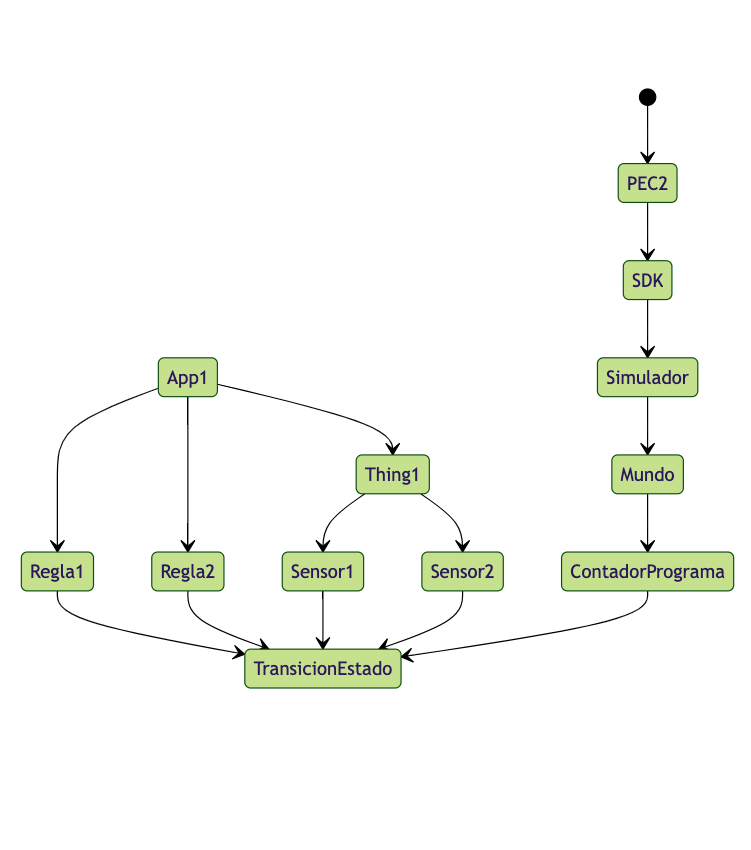
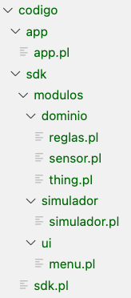
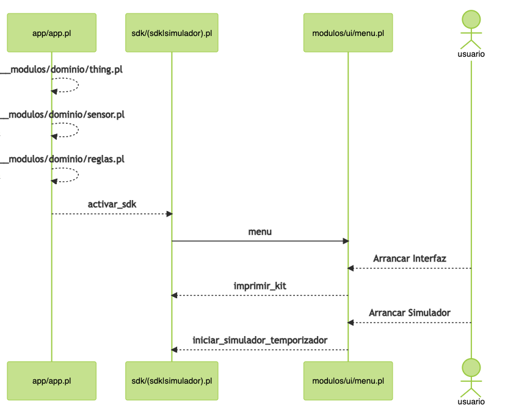

Asignatura de Grado
FUNDAMENTOS DE INTELIGENCIA ARTIFICIAL Curso: 2023/2024

# Actividad Obligatoria II
## CONSTRUCCIÓN EN PROLOG DE UN SISTEMA BASADO EN REGLAS BÁSICO

Aleph Euler

### "Sistema experto de monitorización y mantenimiento predictivo para IoT"

El sistema permite crear "aplicaciones" que usan un "sdk" para simular el funcionamiento de Kits IoT. El "sdk" provee métodos para gestionar la Interfaz de Usuario y el Simulador, código compartido por las aplicaciones.

El proceso de creación de la app consiste en definir los Kits mediante la agregación de asserts Things que, a su vez, se componen de Sensores. Además, se definirán reglas que aplican a los sensores.

Una vez definida, la aplicación puede ser ejecutada mediante el simulador del "sdk".

Como ejemplo, se ha implementado un caso concreto que modeliza una fábrica con un motor y un depósito.

La aplicación define las máquinas y el protocolo de optimización (dummy) para un funcionamiento sostenible.

<div style="page-break-after: always;"></div>

# 1. Dominio

*(La descripción del conocimiento del dominio modelado en forma estructurada, clara, precisa e inequívoca).*

Dentro de la categoría "Objetivos de Desarrollo Sostenible de Naciones Unidas" se pretende: "Sistema experto de monitorización y mantenimiento predictivo para IoT" cuyo objetivo abarcaría no solo indicar errores de funcionamiento sino optimizar y calibrar para un funcionamiento sostenible.



## Modelo

- Kits: Definidos como agrupaciones de 1 a n Things. Y de 1 a n "modos" de funcionamiento.
- Things: Definidas como agrupaciones de 1 a n sensores y de 1 a n acciones de funcionamiento.
- Sensores: Definidos con un nombre, una unidad, un valor actual y un rango de funcionamiento.
- Reglas: Definidas como condición/acción que relacionan los valores simulados de los sensores.




<div style="page-break-after: always;"></div>

# 2. Metodología
*(La descripción breve de la metodología de desarrollo simplificada que se ha aplicado)*

En general, se divide el proyecto en las siguientes fases:

- Estructura de ficheros y creación del sdk.
Para este bloque deben aprenderse los conceptos relativos a la declaración y uso de módulos mediante las instrucciones: *module* y *use_module*. Los predicados o definiciones deben ser publicadas y consumidas.

- Modelización del dominio: sensores, things.
Para este bloque deberán crearse distintos predicados *dymamic* que se agregarán al programa mediante *asserts*. Se aplicarán hechos con y sin variables, así como predicados, que permitan gestionar distintos mecanismos de simulación. Por ejemlo, un sensor que dado un valor de consigna y un valor de incremento provea de un método de transición en que aumente su valor hacia la consigna. Etc.

- Modelización del simulador: reglas.
En este bloque, similar al anterior, deberá diseñarse un mecanismo condición/acción que permita crear las reglas relacionadas con los valores de los sensores. El mecanismo de simulación deberá probar en cada paso del ciclo si la condición aplica y, entonces, llamar, mediante *call* a la acción.

- Menú de aplicación
El menú deberá construirse mediante la declaración de hechos de tipo opción y subopción de modo que, recursivamente, puedan listarse las opciones así como la tecla que el usuario debe introducir para activarla. Deberán usarse las instrucciones *forall*, *read*, *writeln*, *format* para su construcción.

- Consulta de Kits
Habrán dos tipos de listado: Things/sensores y reglas. Para estas impresiones deberá imprimirse por cada Thing una lista de sus sensores.

- Simulador virtual de kits
El simulador constará de los siguiente elementos: a) gestor del mundo; b) contador de programa.

- Gestor de mundo: El simulador deberá usar thread_create para desasociar la consola de simulación de la interfaz de usuario. De ese modo, mientras que la consola de simulación reporta el estado en un thread, en el otro puede escuchar al usuario por si desea interrumpir. Además, el gestor mantendrá el ciclo (controlado mediante *sleep*) del contador de programa.

- Contador de programa: El contador mantiene las transiciones de estado del ciclo de vida. A cada iteración deberá ejecutar las reglas del sistema contra los valores de los sensores de modo que se aplica la lógica programa en la aplicación.

- Aplicación de ejemplo
Una vez armado el SDK se creará la primera de prueba. Para ello se definirá un pequeño experimento (dummy) en el que se busca la forma óptima y sostenible para un motor que procesa cargas de trabajo. Se definirá un buffer/depósito cuya alimentación mediante reglas perseguirá el funcionamiento óptimo del sistema. Aunque para esta prueba no es necesaria la implementaición de la función de optimización y valdrá un valor aleatorio.

<div style="page-break-after: always;"></div>

# 3. Estructura
*(La descripción de la estructura de la base de reglas y de las consideraciones de eficiencia realizadas.)*

El sistema se compone de dos elementos: a) Un SDK con herramientas; b) Un ejemplo de App concreta usando el SDK.



<div style="page-break-after: always;"></div>

- Módulo 1, sdk
UI: menú de usuario, da acceso a las subpantallas.
    - dominio: Permite listar por pantalla los componentes y reglas del mundo.
    - simulador: Ejecuta el mundo virtual mostrando para cada paso del contador de programa el estado del mundo.



<div style="page-break-after: always;"></div>

- Módulo 2, aplicación
A partir de las herramientas provistas en el SDK, el módulo aplicación permite modelizar el mundo IoT de forma ad hoc. Para ello deben definirse: Things con sus Sensores, y un sistema reglas condición/acción.



<div style="page-break-after: always;"></div>

# 4. Código
*(El código comentado en Prolog, en forma de base de reglas y hechos.)*

Estructura de ficheros:



<div style="page-break-after: always;"></div>

Diagrama funcional por ficheros:



A CONTINUACIÓN SE MUESTRAN LAS CABECERAS Y DEFINICIONES DEL CÓDIGO. PARA CÓDIGO COMPLETO VER CARPETA ADJUNTA.

<div style="page-break-after: always;"></div>

## sdk/modulos/ui/menu.pl

```prolog
% ******************** SDK/UI/MENU *****************************
% * Ejecutar prolog? menu. *
% ******************** SDK/UI/MENU *****************************

% Opciones del menú principal
...
% Submenú para la opción 0 - Interfaz
...
% Submenú para la opción 1 - Simulador
...
% Activadores de pantallas
...
% Instancia el menú
menu :- ...

```

<div style="page-break-after: always;"></div>

## sdk/sdk.pl

```prolog
% ******************** SDK *****************************
% * Funcionalidad: a) dominio, b) reglas, c) simulador *
% ******************** SDK *****************************

% thing(IdThing, Nombre, Descripción, [ListaSensores])
:- dynamic thing/4.

% sensor(Id, Nombre, Descripción, Unidad, ValorActual, ValorConsigna, ValorIncremento).
:- dynamic sensor/7.

% regla(IdRegla, Criterio, Accion, Descripcion, Activada)
:- dynamic regla/5.

imprimir_kit :- ...

imprimir_reglas :- ...

% Instancia el SDK y lanza la interfaz UI
activar_sdk:- format('[Modulo: SDK] ~n', []),
    inicializar_things,
    inicializar_reglas,
    menu.
```

<div style="page-break-after: always;"></div>

## sdk/modulos/dominio/thing.pl

```prolog
% ******************** SDK/MODULOS/THING *****************************
% * Funcionalidad: a) set/get b) transicion por consigna *
% ******************** SDK/MODULOS/THING *****************************

%
inicializar_things :- ...

%
thing_lista_sensores(Id, ListaSensores) :- ...

%
imprimir_sensores([IdSensor|Resto]) :- ...

%
imprimir_estado([IdSensor|Resto]) :- ...

%
imprimir_thing(Id) :- ...

%
imprimir_ficha_thing(Id) :- ...

% Función de transición para el simulador
transicion_estado([IdSensor|Resto]) :- ...

simulador_thing(Id) :- ...
```

<div style="page-break-after: always;"></div>

## sdk/modulos/dominio/sensor.pl

```prolog
% ******************** SDK/MODULOS/SENSOR *****************************
% * Funcionalidad: a) set/get b) transicion por consigna *
% ******************** SDK/MODULOS/SENSOR *****************************

% Predicados para obtener y establecer el valor del sensor
sensor_valor_actual(Id, Valor) :- ...

sensor_valor_actual_guardar(Id, NuevoValor) :- ...

sensor_valor_actual_guardar(Id, Consigna, Incremento) :- ...

% Predicado para actualizar la simulación del sensor.
% En este caso simulamos un mecanismo de consigna:
% dado un valor deseado, el valor actual se incrementa
% para aproximarse a la consigna
transicion_estado_sensor(Id) :- ...
```

<div style="page-break-after: always;"></div>

## sdk/modulos/dominio/reglas.pl
```prolog
% ******************** SDK/MODULOS/REGLAS *****************************
% * Métodos para gestionar reglas *
% ******************** SDK/MODULOS/REGLAS *****************************

inicializar_reglas :- ...

% Dado un sensor, devuelve una lista de reglas cuya condicion
% coincida con el valor actual del sensor
buscar_reglas(IdSensor, Valor, ReglasCoincidentes) :- ...

imprimir_reglas([regla(Id, _, _, Desc, Activada)|Resto]) :- ...

verificar_reglas :- ...

```

<div style="page-break-after: always;"></div>

## sdk/simulador/simulador.pl

```prolog
% ******************** SDK/SIMULADOR *****************************
% * Funcionalidad: a) Ciclo Vida simulación b) Manejador de reglas *
% ******************** SDK/SIMULADOR *****************************

% Variable global para controlar el estado del temporizador
:- dynamic temporizador_activo/1.
temporizador_activo(true).

% Ciclo: para cada Thing registrada en el sistema,
% llama a la transición de estado de sus sensores
:- dynamic estado_contador_programa/1.
estado_contador_programa(0).

contadorDePrograma :-

% Función para iniciar el temporizador. Crea 2 threads independientes
%   - Thread de estado: ejecuta el pulso de transición a todos los sensores del mundo
%   - Thread para UI (parada): escucha la señal de parada por parte del usuario
iniciar_simulador_temporizador :-  ...

% Ciclo de repetición, a cada paso incrementa el contador de programa
ciclo_reloj :- ...

% Función que destruye el ciclo
parar :-  ...

% Función que recoge la señal de parada
escuchar_tecla :- ...
```

<div style="page-break-after: always;"></div>

## app/app.pl

```prolog
% Constantes para los dispositivos
sensorMotor.
sensorTrabajo.
thingRobot.

sensorDeposito.
thingDeposito.

% *********************************************************
% * Condición para el Sensor Depósito
% *********************************************************
esSensorDeposito(IdSensor) :- ...
quedaCapacidad(NuevoValor) :- ...
motorTrabajando :- ...

% Predicado principal
condicionDeposito(IdSensor, NuevoValor) :- ...

% *********************************************************
% * Acción para el Sensor Depósito
% *********************************************************
capacidadDisponible(IdSensor, Capacidad, ValorActual) :- ...
optimizarCapacidad(Capacidad, ValorActual, ValorOptimizado) :- ...
verificarCapacidad(ValorOptimizado) :- ...

% Predicado principal
accionDeposito(IdRegla, IdSensor, _) :- ...

% *********************************************************
% * Condición para el Sensor Motor
% *********************************************************
condicionMotor(IdSensor, NuevoValor) :- ...

% *********************************************************
% * Acción para el Sensor Motor
% *********************************************************
transicionMotor(IdSensor) :- ...
transicionTrabajo :- ...
transicionDeposito(CargaDeTrabajoRestante) :- ...

% Predicado principal
accionMotor(IdRegla, IdSensor, _) :- ...

% *********************************************************
% * Carga de dominio y reglas
% *********************************************************
inicializar_things :-
inicializar_reglas :-

% *********************************************************
% * Arranque de aplicación
% *********************************************************
:- format('[Modulo: Aplicación] ~n', [])
```

<div style="page-break-after: always;"></div>

# 5. Casos de prueba
*(La descripción de casos de prueba necesarios para mostrar que el sistema responde a las funcionalidades requeridas (preguntas Prolog sobre los predicados y hechos sin y con variables, que impliquen encadenamiento; y muestra de las respuestas correspondientes proporcionadas por el intérprete)*

## Arranque del sistema

Arrancamos el fichero principal y obtenemos: a) informe de carga de los módulos, b) menú principal.

```
Mac-mini-de-Enrique:app morente$ swipl app.pl
[Modulo: Aplicación]
[Modulo: SDK]
[Modulo: Things]
[Modulo: Reglas]
Bienvenido al sistema, seleccione una opción:
 - 0: Arrancar interfaz
 - 1: Arrancar simulador
3: Salir
```

## Acceso al dominio

Pulsamos "0." para acceder al menú de listados:

```
|: 0.
Interfaz iniciada.
 - 0: Dominio
 - 1: Reglas
99: Salir
```

Pulsamos "0." para listar el dominio:

```
|: 0.
- Things del Kit:
    - Thing: (Robot),  Modeliza un robot que procesa "cargas" de trabajo
        - Nº de sensores: 2
        - sensorMotor, Nombre: Ciclo, Procesa una carga de trabajo por ciclo, Valor: (nº de paso) 1, consigna: 1 (1)
        - sensorTrabajo, Nombre: Trabajo, Contador de carga de trabajo pendiente, Valor: (nº paquetes) 20, consigna: 20 (0)
    - Thing: (Contenedor),  Almacén inteligente
        - Nº de sensores: 1
        - sensorDeposito, Nombre: Carga, Contador de cargas, Valor: (nº paquetes) 0, consigna: 10 (0)
```

Pulsamos "1." para listar las reglas:
```
|: 1.
    - Reglas: 2
        - Regla ID: 1, Descripción: Revoluciones del Motor, (Activada: true)
        - Regla ID: 2, Descripción: Optimizador de Carga, (Activada: true)
Interfaz iniciada.
 - 0: Dominio
 - 1: Reglas
99: Salir
```

Pulsamos "99." para volver al menú principal:

```
|: 99.
Saliendo del submenu...
Bienvenido al sistema, seleccione una opción:
 - 0: Arrancar interfaz
 - 1: Arrancar simulador
3: Salir
```
<div style="page-break-after: always;"></div>

##  Arranque del simulador

La aplicación simula un caso dummy donde se pretende optimizar la carga de un buffer de trabajo:

- thingRobot
    - sensorMotor: define un movimiento de tipo péndulo controlado por consigna (entre x y -x) que simula el tiempo necesario del motor para procesar una carga. Cada vez que el motor cumpla un ciclo, se considera una carga de trabajo procesada.
    - sensorTrabajo: contador de trabajo total. Dada una consigna de carga de trabajo, se descontará una unidad cada vez que el motor procese una carga.

- thingDeposito
    - sensorDeposito: simboliza un buffer de cargas de trabajo. El motor tomará las unidades de este buffer. Se modeliza una optimización dummy en la que se agregará una optimización de carga (en este caso, aleatoria). Para ello, el sensor pedirá carga de trabajo cuando el motor la libere. Además, se detendrá el sistema una vez vaciada toda la carga de trabajo de modo que se ahorre energía.

```
Bienvenido al sistema, seleccione una opción:
 - 0: Arrancar interfaz
 - 1: Arrancar simulador
3: Salir
```

Pulsamos "1." para entrar en el simulador.

Pulsamos "0." para arrancar la simulación. En un futuro, se prevee una segunda opción que permita salvar el estado de la simulación y arrancarla posteriormente.

```
|: 1.
Simulador iniciado.
 - 0: Simular desde el principio
 - 1: Simular desde punto de restauración [No implementado]
99: Salir
|: 0.
```

Instante t = 0. Se crean 2 threads indendientes, uno para la gestión del mundo virtual y otro para recoger la señal de parada del usuario (pulsando cualquier tecla se detendría la simulación).
```
Simulación iniciada desde el principio.
       - Arrancando temporizador de la simulación.
Pulse cualquier tecla para detener.
|:
       - Aplicando incremento temporizador.
```

Instante t = 1.
    - El motor inicia su movimiento desde el estado 0. Avanzará hasta su cota máxima: 1.
    - El sensor de trabajo se ha inicializado con la carga total de proceso: 20 unidades.
    - El buffer (depósito) de trabajo está vacío.
    - La regla id es aplicada determinando que la carga óptima del buffer de trabajo será 6 unidades.
    - El simulador avanza el contador de programa

```
CP con 1
        - sensorMotor, Valor: (0) 1, consigna: 1
        - sensorTrabajo, Valor: (20) 20
        - sensorDeposito, Valor: (0) 10
|: [Se produce carga de buffer, valor optimizado: 6]
        - Regla ID: 2, Descripción: Optimizador de Carga, (Activada: true)
       - Aplicando incremento temporizador.
```

Instante t = 2.
    - El motor alcanza la cota máxima y por tanto ejecuta un procesamiento de trabajo retirando una unidad tanto del contador general como del buffer.
    - La regla de optimización determina que deben agregarse 0 nuevas unidades al buffer.

```
CP con 2
        - sensorMotor, Valor: (1) 1, consigna: 1
[El motor ha concluído un ciclo de trabajo.]
[Se retira una unidad de carga de trabajo, quedan  5.]
        - sensorTrabajo, Valor: (19) 20
        - sensorDeposito, Valor: (5) 10
[Se produce carga de buffer, valor optimizado: 0]
        - Regla ID: 2, Descripción: Optimizador de Carga, (Activada: true)
       - Aplicando incremento temporizador.
```

Instante t=3.
    - El motor avanza hacia su cota mínima.
    - La regla de optimización considera 4 nuevas unidades y las agrega al buffer de trabajo.

```
CP con 3
        - sensorMotor, Valor: (0) -1, consigna: 1
        - sensorTrabajo, Valor: (19) 20
        - sensorDeposito, Valor: (5) 10
[Se produce carga de buffer, valor optimizado: 4]
        - Regla ID: 2, Descripción: Optimizador de Carga, (Activada: true)
       - Aplicando incremento temporizador.

```

Instante t=3. Similar a los casos anteriores, el motor concluye un ciclo, decrementa el sensor global y el buffer.

```
CP con 4
        - sensorMotor, Valor: (-1) -1, consigna: 1
[El motor ha concluído un ciclo de trabajo.]
[Se retira una unidad de carga de trabajo, quedan  8.]
        - sensorTrabajo, Valor: (18) 20
        - sensorDeposito, Valor: (8) 10
[Se produce carga de buffer, valor optimizado: 0]
        - Regla ID: 2, Descripción: Optimizador de Carga, (Activada: true)
       - Aplicando incremento temporizador.

CP con 5
        - sensorMotor, Valor: (0) 1, consigna: 1
        - sensorTrabajo, Valor: (18) 20
        - sensorDeposito, Valor: (8) 10
[Se produce carga de buffer, valor optimizado: 2]
        - Regla ID: 2, Descripción: Optimizador de Carga, (Activada: true)
       - Aplicando incremento temporizador.

CP con 6
        - sensorMotor, Valor: (1) 1, consigna: 1
[El motor ha concluído un ciclo de trabajo.]
[Se retira una unidad de carga de trabajo, quedan  9.]
        - sensorTrabajo, Valor: (17) 20
        - sensorDeposito, Valor: (9) 10
[Se produce carga de buffer, valor optimizado: 1]
        - Regla ID: 2, Descripción: Optimizador de Carga, (Activada: true)
       - Aplicando incremento temporizador.
```

Instante t = 7. Dado que el buffer está en su máxima capacidad (10 unidades) no salta la regla de optimización y no se agrega carga de tra bajo.

```
CP con 7
        - sensorMotor, Valor: (0) -1, consigna: 1
        - sensorTrabajo, Valor: (17) 20
        - sensorDeposito, Valor: (10) 10
       - Aplicando incremento temporizador.

CP con 8
        - sensorMotor, Valor: (-1) -1, consigna: 1
[El motor ha concluído un ciclo de trabajo.]
[Se retira una unidad de carga de trabajo, quedan  9.]
        - sensorTrabajo, Valor: (16) 20
        - sensorDeposito, Valor: (9) 10
[Se produce carga de buffer, valor optimizado: 1]
        - Regla ID: 2, Descripción: Optimizador de Carga, (Activada: true)
       - Aplicando incremento temporizador.

CP con 9
        - sensorMotor, Valor: (0) 1, consigna: 1
        - sensorTrabajo, Valor: (16) 20
        - sensorDeposito, Valor: (10) 10
       - Aplicando incremento temporizador.

CP con 10
        - sensorMotor, Valor: (1) 1, consigna: 1
[El motor ha concluído un ciclo de trabajo.]
[Se retira una unidad de carga de trabajo, quedan  9.]
        - sensorTrabajo, Valor: (15) 20
        - sensorDeposito, Valor: (9) 10
[Se produce carga de buffer, valor optimizado: 0]
        - Regla ID: 2, Descripción: Optimizador de Carga, (Activada: true)
       - Aplicando incremento temporizador.

CP con 11
        - sensorMotor, Valor: (0) -1, consigna: 1
        - sensorTrabajo, Valor: (15) 20
        - sensorDeposito, Valor: (9) 10
[Se produce carga de buffer, valor optimizado: 1]
        - Regla ID: 2, Descripción: Optimizador de Carga, (Activada: true)
       - Aplicando incremento temporizador.

CP con 12
        - sensorMotor, Valor: (-1) -1, consigna: 1
[El motor ha concluído un ciclo de trabajo.]
[Se retira una unidad de carga de trabajo, quedan  9.]
        - sensorTrabajo, Valor: (14) 20
        - sensorDeposito, Valor: (9) 10
[Se produce carga de buffer, valor optimizado: 1]
        - Regla ID: 2, Descripción: Optimizador de Carga, (Activada: true)
       - Aplicando incremento temporizador.

CP con 13
        - sensorMotor, Valor: (0) 1, consigna: 1
        - sensorTrabajo, Valor: (14) 20
        - sensorDeposito, Valor: (10) 10
       - Aplicando incremento temporizador.

CP con 14
        - sensorMotor, Valor: (1) 1, consigna: 1
[El motor ha concluído un ciclo de trabajo.]
[Se retira una unidad de carga de trabajo, quedan  9.]
        - sensorTrabajo, Valor: (13) 20
        - sensorDeposito, Valor: (9) 10
[Se produce carga de buffer, valor optimizado: 0]
        - Regla ID: 2, Descripción: Optimizador de Carga, (Activada: true)
       - Aplicando incremento temporizador.

CP con 15
        - sensorMotor, Valor: (0) -1, consigna: 1
        - sensorTrabajo, Valor: (13) 20
        - sensorDeposito, Valor: (9) 10
[Se produce carga de buffer, valor optimizado: 0]
        - Regla ID: 2, Descripción: Optimizador de Carga, (Activada: true)
       - Aplicando incremento temporizador.

CP con 16
        - sensorMotor, Valor: (-1) -1, consigna: 1
[El motor ha concluído un ciclo de trabajo.]
[Se retira una unidad de carga de trabajo, quedan  8.]
        - sensorTrabajo, Valor: (12) 20
        - sensorDeposito, Valor: (8) 10
[Se produce carga de buffer, valor optimizado: 0]
        - Regla ID: 2, Descripción: Optimizador de Carga, (Activada: true)
       - Aplicando incremento temporizador.

CP con 17
        - sensorMotor, Valor: (0) 1, consigna: 1
        - sensorTrabajo, Valor: (12) 20
        - sensorDeposito, Valor: (8) 10
[Se produce carga de buffer, valor optimizado: 1]
        - Regla ID: 2, Descripción: Optimizador de Carga, (Activada: true)
       - Aplicando incremento temporizador.

CP con 18
        - sensorMotor, Valor: (1) 1, consigna: 1
[El motor ha concluído un ciclo de trabajo.]
[Se retira una unidad de carga de trabajo, quedan  8.]
        - sensorTrabajo, Valor: (11) 20
        - sensorDeposito, Valor: (8) 10
[Se produce carga de buffer, valor optimizado: 0]
        - Regla ID: 2, Descripción: Optimizador de Carga, (Activada: true)
       - Aplicando incremento temporizador.

CP con 19
        - sensorMotor, Valor: (0) -1, consigna: 1
        - sensorTrabajo, Valor: (11) 20
        - sensorDeposito, Valor: (8) 10
[Se produce carga de buffer, valor optimizado: 0]
        - Regla ID: 2, Descripción: Optimizador de Carga, (Activada: true)
       - Aplicando incremento temporizador.

CP con 20
        - sensorMotor, Valor: (-1) -1, consigna: 1
[El motor ha concluído un ciclo de trabajo.]
[Se retira una unidad de carga de trabajo, quedan  7.]
        - sensorTrabajo, Valor: (10) 20
        - sensorDeposito, Valor: (7) 10
[Se produce carga de buffer, valor optimizado: 0]
        - Regla ID: 2, Descripción: Optimizador de Carga, (Activada: true)
       - Aplicando incremento temporizador.

CP con 21
        - sensorMotor, Valor: (0) 1, consigna: 1
        - sensorTrabajo, Valor: (10) 20
        - sensorDeposito, Valor: (7) 10
[Se produce carga de buffer, valor optimizado: 1]
        - Regla ID: 2, Descripción: Optimizador de Carga, (Activada: true)
       - Aplicando incremento temporizador.

CP con 22
        - sensorMotor, Valor: (1) 1, consigna: 1
[El motor ha concluído un ciclo de trabajo.]
[Se retira una unidad de carga de trabajo, quedan  7.]
        - sensorTrabajo, Valor: (9) 20
        - sensorDeposito, Valor: (7) 10
       - Aplicando incremento temporizador.

CP con 23
        - sensorMotor, Valor: (0) -1, consigna: 1
        - sensorTrabajo, Valor: (9) 20
        - sensorDeposito, Valor: (7) 10
       - Aplicando incremento temporizador.

CP con 24
        - sensorMotor, Valor: (-1) -1, consigna: 1
[El motor ha concluído un ciclo de trabajo.]
[Se retira una unidad de carga de trabajo, quedan  6.]
        - sensorTrabajo, Valor: (8) 20
        - sensorDeposito, Valor: (6) 10
       - Aplicando incremento temporizador.

CP con 25
        - sensorMotor, Valor: (0) 1, consigna: 1
        - sensorTrabajo, Valor: (8) 20
        - sensorDeposito, Valor: (6) 10
       - Aplicando incremento temporizador.

CP con 26
        - sensorMotor, Valor: (1) 1, consigna: 1
[El motor ha concluído un ciclo de trabajo.]
[Se retira una unidad de carga de trabajo, quedan  5.]
        - sensorTrabajo, Valor: (7) 20
        - sensorDeposito, Valor: (5) 10
       - Aplicando incremento temporizador.

CP con 27
        - sensorMotor, Valor: (0) -1, consigna: 1
        - sensorTrabajo, Valor: (7) 20
        - sensorDeposito, Valor: (5) 10
       - Aplicando incremento temporizador.

CP con 28
        - sensorMotor, Valor: (-1) -1, consigna: 1
[El motor ha concluído un ciclo de trabajo.]
[Se retira una unidad de carga de trabajo, quedan  4.]
        - sensorTrabajo, Valor: (6) 20
        - sensorDeposito, Valor: (4) 10
       - Aplicando incremento temporizador.

CP con 29
        - sensorMotor, Valor: (0) 1, consigna: 1
        - sensorTrabajo, Valor: (6) 20
        - sensorDeposito, Valor: (4) 10
[Se produce carga de buffer, valor optimizado: 2]
        - Regla ID: 2, Descripción: Optimizador de Carga, (Activada: true)
       - Aplicando incremento temporizador.

CP con 30
        - sensorMotor, Valor: (1) 1, consigna: 1
[El motor ha concluído un ciclo de trabajo.]
[Se retira una unidad de carga de trabajo, quedan  4.]
        - sensorTrabajo, Valor: (5) 20
        - sensorDeposito, Valor: (5) 10
       - Aplicando incremento temporizador.

CP con 31
        - sensorMotor, Valor: (0) -1, consigna: 1
        - sensorTrabajo, Valor: (5) 20
        - sensorDeposito, Valor: (5) 10
       - Aplicando incremento temporizador.

CP con 32
        - sensorMotor, Valor: (-1) -1, consigna: 1
[El motor ha concluído un ciclo de trabajo.]
[Se retira una unidad de carga de trabajo, quedan  3.]
        - sensorTrabajo, Valor: (4) 20
        - sensorDeposito, Valor: (4) 10
       - Aplicando incremento temporizador.

CP con 33
        - sensorMotor, Valor: (0) 1, consigna: 1
        - sensorTrabajo, Valor: (4) 20
        - sensorDeposito, Valor: (4) 10
       - Aplicando incremento temporizador.

CP con 34
        - sensorMotor, Valor: (1) 1, consigna: 1
[El motor ha concluído un ciclo de trabajo.]
[Se retira una unidad de carga de trabajo, quedan  2.]
        - sensorTrabajo, Valor: (3) 20
        - sensorDeposito, Valor: (3) 10
       - Aplicando incremento temporizador.

CP con 35
        - sensorMotor, Valor: (0) -1, consigna: 1
        - sensorTrabajo, Valor: (3) 20
        - sensorDeposito, Valor: (3) 10
       - Aplicando incremento temporizador.

CP con 36
        - sensorMotor, Valor: (-1) -1, consigna: 1
[El motor ha concluído un ciclo de trabajo.]
[Se retira una unidad de carga de trabajo, quedan  1.]
        - sensorTrabajo, Valor: (2) 20
        - sensorDeposito, Valor: (2) 10
       - Aplicando incremento temporizador.

CP con 37
        - sensorMotor, Valor: (0) 1, consigna: 1
        - sensorTrabajo, Valor: (2) 20
        - sensorDeposito, Valor: (2) 10
       - Aplicando incremento temporizador.
```

Instante t = 38. Se concluído el trabajo. Las reglas de los sensores quedan anuladas y se ejecuta la rutina de parada.

```
CP con 38
        - sensorMotor, Valor: (1) 1, consigna: 1
[El motor ha concluído un ciclo de trabajo.]
[Se retira una unidad de carga de trabajo, quedan  0.]
[No queda carga de trabajo, el motor se parará.]
Iniciar rutina parar.
Temporizador detenido.
99: Salir
```

<div style="page-break-after: always;"></div>

# 6. Evaluación
*(Un informe breve de las dificultades encontradas, y una valoración de las aportaciones y/o inconvenientes relacionados con la aplicación de la metodología de desarrollo.)*

En general, el proceso de desarrollo de la práctica ha sido constructivo y fácil, gracias a la documentación existente.

Quizás considerar que los objetivos iniciales eran demasiado ambiciosos y se ha tenido que reducir el proyecto a la simulación con pocos elementos.

- Estructura de ficheros y creación del sdk.
Al principio fue algo confuso comprender la definición de módulos y la publicación de sus predicados. Sin embargo, una vez comprendido el concepto fue muy útil para crear código reutilizable en el SDK. Separando distintos módulos según su funcionalidad y publicando los métodos que otros ficheros deberían usar.

- Modelización del dominio: sensores, things.
Costó comprender que dada la variedad de archivos del sistema era importante centralizar la definición de los dynamics para que todos los ficheros tuvieran acceso a los asserts. Al final se centralizaron en el archivo sdk.pl, y los demás ficheros accedían él. Se ha creado unos hechos relativamente sencillos para evitar complejidades.

- Modelización del simulador: reglas.
Quizás este punto ha costado más que los demás y, valoro, ha quedado bastante cojo. Aunque al principio se desarrollaron reglas para buscar valores numéricos, por ejemplo: SaltarSiValorMayorQue o SaltarSiValorEnRango, al final decidí simplificar el motor de búsqueda a una condición externa que el creador de la app incializará al principio. De ese modo, el SDK únicamente debería llamar a la condición para saber si debía ejecutar su acción dando así libertad al usuario para modelar su aplicación.

- Menú de aplicación
En este punto lo más complicado fue gestionar la recursividad de las opciones y lograr el flujo de ida y vuelta entre niveles sin que el programa entrara en estados infinitos.

- Consulta de Kits
La impresión de los kits mediante funciones de recursividad con listas fueron bastante inmediatas.

- Gestor de mundo: Buscando un mecanismo para poder arrancar el simulador y, a la vez, escuchar las teclas del usuario para interrumpir (o, en un futuro, para agregar funcionalidad durante la simulación) perdí bastante tiempo hasta encontrar el concepto thread_create.

- Contador de programa: Para el desarrollo este bloque tuve que buscar bastante en la documentación y ejemplos de modo que pudiera cubrir todas las partes. El uso de *repeat* y *sleep* quizás fue la parte más compleja de resolver:

```
ciclo_reloj :-
    repeat,
    (
        temporizador_activo(true)
    ->
        writeln('       - Aplicando incremento temporizador.'),
        contadorDePrograma(),
        sleep(1),
        fail
    ; !
    ).
```

- Aplicación de ejemplo
Me hubiera gustado disponer de más tiempo para proseguir desarrollando otras aplicaciones de ejemplo a partir del sdk. Podría haber ilustrado mejor las posibilidades del sistema. Me costó centrarme en lo esencial para crear una primera y el ejemplo de uso que ha quedado quizás no es lo suficientemente interesante.

# 7. Consideraciones éticas
*(OPCIONALMENTE se podrá incluir un análisis de los riesgos éticos que plantearía el uso del sistema (con extensión de alrededor de una página por estudiante en el grupo de trabajo)*.

Esta aplicación permite modelizar entornos IoT para simulación y en principio no debería conllevar graves implicaciones éticas. Los casos de uso y aplicación pasarían por obtener información de análisis para casos simulados, dejando fuera de ámbito los efectos colaterales de un sistema aplicado en entornos reales. Al suponerse un programa para laboratorio y pruebas se le presupone nulo impacto, éticamente viable.